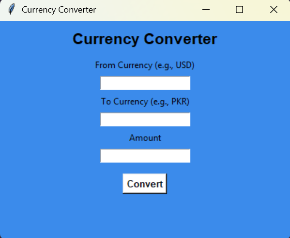

# 💱 Currency Converter (CLI + GUI)

This project is a Python-based **Currency Converter** that allows users to convert amounts between different currencies using **real-time exchange rates** from [ExchangeRatesAPI.io](https://exchangeratesapi.io). The application provides both:

- A **Command-Line Interface (CLI)**
- A **Graphical User Interface (GUI)** built with Tkinter

---

## 🛠 Features

- Fetches live currency exchange rates
- Supports multiple currencies (USD, PKR, EUR, GBP, TRY, etc.)
- Converts currency based on user input
- CLI version for quick use in terminal
- GUI version with clean and simple interface using `tkinter`
- Error handling for invalid input, network issues, and incorrect currency codes

---

## 📦 Requirements

- Python 3.x
- `requests` library
- `tkinter` (comes pre-installed with Python)

Install `requests` if not already available:

```bash
pip install requests

```

## 🧪 How to Run

### ▶ CLI Version (Jupyter Notebook)

1. Open the Jupyter Notebook file:  
   **`CurrConverter.ipynb`**

2. Run the cells one by one.

3. You will be prompted to enter:
   - From Currency (e.g., USD)
   - To Currency (e.g., PKR)
   - Amount

4. The converted result will be displayed as output in the notebook.

> 💡 **Note:** Make sure Jupyter Notebook is installed. Launch it using:

```bash
jupyter notebook

```
## ▶ GUI Version (Tkinter)

### How to Run:

1. Run the script.
   
```bash
CC_GUI.py

```

A window will open with input fields:
    - From Currency (e.g., USD)
    - To Currency (e.g., PKR)
    - Amount to convert

Click the Convert button to view the converted result.

Note: Make sure you have Python installed with the tkinter and requests libraries.
You can install required packages with:

```bash
pip install requests

```

## 🌐 API Used

This project uses ExchangeRatesAPI.io to fetch live exchange rates.

- API Endpoint:
    http://api.exchangeratesapi.io/v1/latest
- You need a valid access key (a free key is available upon signup).
- Replace the access_key in the code with your own:

```bash
url = "http://api.exchangeratesapi.io/v1/latest?access_key=YOUR_ACCESS_KEY"

```
- You can also use the following API:
  
  ```bash
    url = "http://api.exchangeratesapi.io/v1/latest?access_key=6a69e76931468c0c738b0052ead8c4bd"
  ```

## 📌 Notes

- The free plan of ExchangeRatesAPI uses EUR as the base currency.
- All conversions are done via EUR internally. If needed, adjust calculations accordingly.

---

## 📄 Files Included

- CurrConverter.ipynb – CLI version using Jupyter Notebook
- CC_GUI.py – GUI version using Tkinter

---

## 📥 Requirements

- Python 3.x
- requests library
- tkinter (comes pre-installed with Python on most systems)
- Install missing dependencies with:

---

## 📷 Screenshots

### GUI Example:



<!-- Make sure the screenshot file is named 'screenshot.png' and located in the same directory as this README. -->


